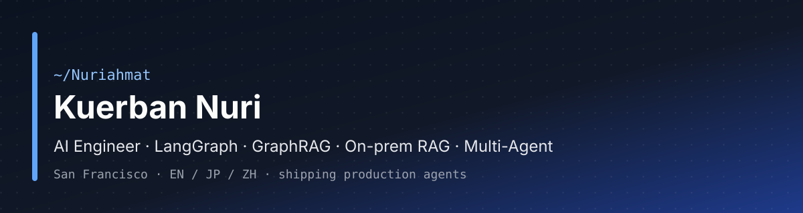

<p align="center">
  
</p>

<h1 align="center">Hey, I'm Kuerban Nuri.</h1>

<p align="center">
  <strong>AI Engineer &amp; Tech Lead in San Francisco.</strong><br/>
  I ship production agent systems: on-prem RAG, LangGraph multi-agent workflows,<br/>
  and hybrid local / frontier routing that does not leak PII.
</p>

<p align="center">
  <a href="https://www.linkedin.com/in/kuerban-nuri"></a>
  <a href="https://github.com/Nuriahmat"></a>
  
  
</p>

<p align="center">
  <a href="https://github.com/andrewyng/openworker">OpenWorker</a> ·
  <a href="https://github.com/Nuriahmat/openworker">My fork</a> ·
  <a href="https://github.com/andrewyng/openworker/pulls?q=is%3Apr+author%3ANuriahmat">Upstream PRs</a> ·
  <a href="https://www.linkedin.com/in/kuerban-nuri">LinkedIn</a>
</p>

---

### 📟 Focus

```text
kuerban@sf:~$ cat focus.conf

now          = on-prem RAG, LangGraph agents, hybrid local/frontier routing
privacy      = Presidio masking before any frontier hop
side_systems = voice agents, inbox automation, agent harness work
path         = Tokyo backends → NYC → San Francisco
looking_for  = seats where production multi-agent is the main job
exit_plan    = ship the next reliable loop, then document what broke
known_issue  = the next agent idea already has a branch name
```

I care about agents that survive real tools, real data, and real failure modes. Not demos that only work on the happy path.

Production backends previously at **Rakuten** and **DMM** in Tokyo. Now building agent systems in SF.

---

## 🚀 What I'm building and shipping

<table>
<tr>
<td width="50%" valign="top">

### 🔐 On-prem RAG & LangGraph

Production retrieval and multi-agent workflows where the corpus, latency, and trust boundaries are not optional. Graph orchestration, tool calling, and ops constraints in the same system.

`Python` `LangGraph` `RAG` `tool calling` `evals`

</td>
<td width="50%" valign="top">

### 🧠 OpenWorker · Hybrid harness

Work on [Andrew Ng's open agent harness](https://github.com/andrewyng/openworker): easy work stays local; harder work can go frontier only after Presidio strips PII and secrets. Same session, different routes.

`Python` `Ollama` `Presidio` `agent harness`

[Fork](https://github.com/Nuriahmat/openworker) · [PR #708](https://github.com/andrewyng/openworker/pull/708)

</td>
</tr>
<tr>
<td width="50%" valign="top">

### 🕸️ Alignfy · GraphRAG planning (portfolio)

Collaborative planning / GraphRAG context-graph system for engineering teams. Friends tested it; the product is paused. Kept here as proof of shipping agentic + graph retrieval end to end, not as a live startup.

`GraphRAG` `multi-agent` `TypeScript`

[alignfy-releases](https://github.com/Nuriahmat/alignfy-releases)

</td>
<td width="50%" valign="top">

### 🎙️ Voice + inbox agent stack

Personal production system for recruiter-path voice and inbox automation: Twilio + ElevenLabs inbound calls, agent workflows for DMs and scheduling. Architecture and judgment under real call paths.

`Twilio` `ElevenLabs` `voice agents` `automation`

</td>
</tr>
</table>

---

## 🧩 Open source

Contributing to **[OpenWorker](https://github.com/andrewyng/openworker)** with a focus on local-model plumbing and harness reliability.

- Upstream: [Ollama: request the model's real context window - #708](https://github.com/andrewyng/openworker/pull/708)
- Local fork: [Nuriahmat/openworker](https://github.com/Nuriahmat/openworker) (hybrid local / frontier routing + Presidio masking)

---

## 🛠 Toolbox

<p align="center">
  
</p>

| Area | What I reach for |
| --- | --- |
| 💻 Languages | Python · TypeScript · Java · SQL · Shell |
| 🤖 Agents & orchestration | LangGraph · LangChain · MCP · tool calling · multi-agent routing |
| 📚 Retrieval | On-prem RAG · GraphRAG · hybrid search · golden sets / LLM-as-judge |
| 🔒 Models & privacy | Local LLMs (Ollama) · frontier APIs · Presidio / PII masking |
| 📞 Voice & messaging | Twilio · ElevenLabs · inbox / DM automation |
| ☁️ Backend & cloud | FastAPI · Node · AWS · Terraform |
| 🚚 Delivery | Git · CI · Cursor · production ops under constraints |

---

## ⚙️ How I work

- **🚢 Ship the loop, not the slide.** Happy path, failure path, and the way back.
- **🛡️ Keep the trust boundary visible.** Local when you can; mask before you hop; know what left the machine.
- **🧪 Prefer systems you can eval.** Traces, golden sets, and regressions beat vibes.
- **✍️ Write like an engineer.** Specific claims, plain words, no buzzword fog.

---

<p align="center">
  
</p>

<p align="center">
  Based in San Francisco. Especially interested in early-stage teams where production agents are the product.<br/>
  <a href="https://www.linkedin.com/in/kuerban-nuri"><strong>Say hello on LinkedIn</strong></a> if you want to talk stack, RAG under constraints, or agent harness work.
</p>

<p align="center">
  <sub>Ship the stack. Talk to it.</sub>
</p>
